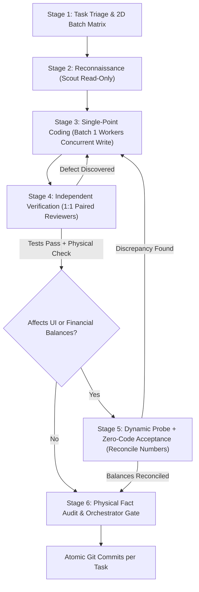

# ⚡ Antigravity Quad

> **High-throughput, anti-hallucination multi-agent orchestration framework custom-engineered for Google Antigravity (AGY).**  
> Powered universally by lightweight, lightning-fast `flash` models, Quad enforces **non-overlapping concurrent implementation**, **independent contract verification**, and **zero-source-code user acceptance** across a clean single Git branch.

**English** | [中文说明 (Chinese)](README_zh.md)

[](LICENSE)
[](https://github.com/google)
[](SKILL.md)

---

## 📖 Table of Contents

- [Why Quad?](#-why-quad)
- [Three Core Design Philosophies](#-three-core-design-philosophies)
- [Four Specialized Roles Matrix](#-four-specialized-roles-matrix)
- [Six-Stage Orchestration Pipeline](#-six-stage-orchestration-pipeline)
- [One-Liner Quick Installation](#-one-liner-quick-installation)
- [License](#-license)

---

## 💡 Why Quad?

When modern AI agents write and refactor complex codebases, single-agent workflows and loosely coupled multi-agent systems suffer from **structural failure**. Regardless of prompt tone or model capability, unconstrained setups inevitably fail in four predictable ways:

```
Typical rubber-stamp review failure:
[Worker writes code] ➔ "I completed this and self-tests pass!" ➔ [Reviewer reads code diff & self-evaluation] ➔ "LGTM, looks clean!" (15+ critical bugs slip into production)
```

The root causes are structural:

1. **Inverted Frame of Reference (Diff vs. Contract)**  
   When a reviewer is asked to "review what the worker changed," its expectation is reverse-engineered from the code's existing behavior. **Assertions derived from implementation behavior are tautological—they always pass.**
2. **Context Pollution (Self-Evaluation Kills Critical Thinking)**  
   Phrases like *"completed," "all self-tests pass,"* or *"ready for review"* provide pre-baked answers in the LLM's context. `flash` models naturally rationalize and follow the existing narrative rather than re-deducing independently.
3. **Cross-Role Corruption (Test Author = Code Author)**  
   When an agent's objective function is "achieve 100% test pass rate," tweaking implementation code to accommodate a test is the path of least resistance. This is an objective flaw, not laziness.
4. **Visual & Arithmetic Blind Spots (Green Unit Tests ≠ Usable Software)**  
   Headless unit tests cannot catch modal dialogs that cannot be dismissed, broken keyboard input stepping, reconnection failures, or balance conservation violations where figures displayed on screen fail to reconcile.

**Quad breaks this deadlock** by injecting separation of powers, physical input isolation, and strict state machine gates into the multi-agent loop.

---

## 🎯 Three Core Design Philosophies

- 🔹 **Flash executes verbs, not adjectives**  
  Demands like "adversarial deduction," "exhaustive check," or "deep audit" are ignored by compact models. Quality guarantees must be formulated as **checkable defect matrices** and **pre-filled, copy-paste executable terminal commands**.
- 🔹 **Independence comes from input isolation, not prompt sentiment**  
  Never yell at an LLM (*"find bugs or you fail"*). Emotional prompting creates noisy trivial edge cases. True independence is achieved by **physically stripping self-evaluations and implementation code from the reviewer's and acceptance tester's context**.
- 🔹 **Keep judgment with humans & orchestrators; delegate execution to flash**  
  Expected acceptance numbers must originate from specifications, mathematical formulas, or human operators. **AI subagents are strictly forbidden from inventing acceptance numbers.**

---

## 🎭 Four Specialized Roles Matrix

All subagents execute under `Model: "flash"` and `Workspace: "inherit"` within a single Git working branch:

| Role | Native TypeName | Reasoning Effort | Core Responsibility | Forbidden Boundaries |
| :--- | :--- | :--- | :--- | :--- |
| 🔍 **Scout** | `research` (read-only) | Low (Fast Direct Mode) | Read-only discovery of symbols, call graphs, PRDs, and contracts | Forbidden to create/modify files; forbidden to execute destructive commands |
| 🛠️ **Worker** | `self` | High (Deep Deduction) | Exclusive file ownership for feature coding; writes happy-path unit tests | Forbidden to touch unauthorized files; forbidden to run Git write commands; forbidden from emitting self-evaluative conclusions |
| 🛡️ **Reviewer** | `code-reviewer` | High (Deep Deduction) | Independent verification against task specifications; writes edge/negative tests; **reports only, never fixes** | **Forbidden to modify non-test files**; forbidden to deduce expectations from code diff; forbidden to issue sign-offs |
| 🎯 **Acceptance** | `research` (read-only) | Low to Medium | Inspects runtime evidence (screenshots/HAR/logs) against scenario cards; reconciles arithmetic balance | **Strictly forbidden from reading any source code**; forbidden to write code; validates that on-screen numbers close arithmetically |

---

## 🔄 Six-Stage Orchestration Pipeline



### 1. Task Triage & 2D Batch Matrix
Worker concurrency is governed strictly by source file disjointness:
$$Files(Worker_A) \cap Files(Worker_B) = \emptyset \implies \text{Must dispatch concurrently in a single } invoke\_subagent \text{ call}$$
Serialization requires concrete evidence: unresolved physical compile symbol dependencies or unavoidable file collisions.

### 2. Reconnaissance & Two-Step Circuit Breaker
Scouts map symbols and contracts in seconds. The master orchestrator follows a two-step circuit breaker, never wasting context window reading extensive business logic in the main session.

### 3. Isolated Feature Coding (No Lock Contention)
Each Worker is granted exclusive ownership of specific source files and injected with isolated build caches (e.g., `CARGO_TARGET_DIR=target/subagents/worker-{ID}`).

### 4. Independent Verification (Input Isolation & Report Only)
- Paired 1:1 with workers the instant they deliver—zero queue latency;
- Orchestrators scrub all self-evaluative praise before dispatching prompts to reviewers;
- Reviewers author reproducing failing tests upon finding bugs, **keeping them red**. Fixing is returned to the Worker.

### 5. User-Perspective Acceptance (Zero-Code Visual & Math Check)
For UI or financial changes, a probe worker captures real browser screenshots and scraped values. The Acceptance subagent verifies that what the user sees satisfies mathematical identities, completely isolated from source code.

### 6. Convergence & Atomic Commits
The master orchestrator acts as the sole Git writer, runs `git status --short` to audit physical files, runs full test gates, and commits changes atomically per task.

---

## 🚀 One-Liner Quick Installation

Run either command in your terminal to install Quad and activate it instantly in Antigravity:

### Option A: Native Git One-Liner (Recommended)

```bash
git clone https://github.com/elias-zhao/antigravity-quad.git ~/.gemini/config/skills/quad
```

> 💡 **How to Update**: Whenever a new version is released, simply run:  
> `cd ~/.gemini/config/skills/quad && git pull`

---

### Option B: Curl Automated Installation

```bash
curl -fsSL https://raw.githubusercontent.com/elias-zhao/antigravity-quad/main/scripts/install.sh | bash
```

---

## 📄 License

This project is licensed under the [MIT License](LICENSE) - see the LICENSE file for details.
