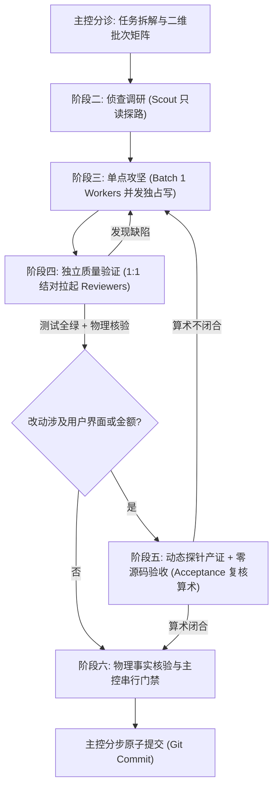

# ⚡ Antigravity Quad

> **面向 Google Antigravity (AGY) 深度设计的高吞吐、防幻觉多智能体协同编排框架。**  
> 统一采用轻量极速模型（`flash`），在单分支环境下实现「无交集并发攻坚 + 独立契约验证 + 零源码用户验收」。

[English Documentation](README.md) | **中文说明**

[](LICENSE)
[](https://github.com/google)
[](SKILL.md)

---

## 📖 目录

- [为什么需要 Quad？](#-为什么需要-quad)
- [核心特性与优势](#-核心特性与优势)
- [实战使用样例 (`/quad`)](#-实战使用样例-quad)
- [三大核心设计哲学](#-三大核心设计哲学)
- [四大专职角色矩阵](#-四大专职角色矩阵)
- [六阶段端到端协同流水线](#-六阶段端到端协同流水线)
- [一行命令极速安装](#-一行命令极速安装)
- [开源许可证](#-开源许可证)

---

## 💡 为什么需要 Quad？

在现代 AI 辅助编码中，直接使用单一 Agent 或无输入隔离的多 Agent 往往会在任务收敛时遭遇**严重的结构性失效**。无论模型态度多端正、Prompt 多严厉，以下问题在单点流程中必然发生：

```
传统审查模式（容易沦为橡皮图章）：
[攻坚员编写代码] ➔ "我已完成且自测通过" ➔ [审查员看到自评与 diff] ➔ "确认实现良好，准予签收" (漏过 15+ 真实缺陷)
```

究其根因，是由四个**底层结构性缺陷**导致的：

1. **参照系颠倒（以 diff 为准 vs 以契约或任务书为准）**  
   若审查员被指示「审计攻坚员改了什么」，其期望值只能从被审代码的现有行为倒推。**从现有代码倒推出来的测试断言，在逻辑上永远必然通过。**
2. **上下文污染（自评破坏独立推演）**  
   攻坚员自评中的「已完成、已自测通过、编译全绿」一旦流入审查员的上下文，就等于向模型预设了一个标准答案。模型会顺着现成结论续写肯定评价，彻底放弃对抗性推演。
3. **职责交叉腐蚀（既写实现又写测试）**  
   当一个 Agent 的考核目标是「让所有测试变绿」，修改实现代码来迎合自己写的测试就是阻力最小的最优解。这是目标函数的天然缺陷，而非态度问题。
4. **前端与视觉盲区（SSR / 单测通过 ≠ 用户可用）**  
   单元测试无法发现弹窗无法关闭、按键步进精度缺失、网络断线后重连失败以及界面金额在算术上未能闭合的缺陷。

**Quad 彻底打破这一死结**，将软件工程顶级的「分权制衡」与「硬门禁隔离」注入多智能体执行链路。

---

## ✨ 核心特性与优势

相比传统的单 Agent 或随意自由组合的多 Agent 流程，Quad 带来了工业级软件工程的确定性与数倍的吞吐量跃升：

| 核心优势 | 传统多 Agent 的痛点与失效 | Quad 的架构解法 |
| :--- | :--- | :--- |
| ⚡ **单分支零冲突并发** | 多个 Agent 随意改文件导致相互覆盖，或因 `.git/index.lock` 与多分支合并陷入「Merge 地狱」。 | **严格数学无交集编排**：基于单文件独占算法（$Files(A) \cap Files(B) = \emptyset$），解耦全局公共文件。实现**吞吐量提升 3x~5x** 的同时保证 100% 零合并冲突与踩踏。 |
| 🛡️ **防橡皮图章与审查造假** | 审查员看代码 diff 和攻坚员自夸（“自测通过”），顺理成章盲目盖章，漏过大量低级与恶性 Bug。 | **物理输入隔离 + 只报告不修复**：彻底过滤自评话术；审查员只能从需求规范独立推导期望值，且**绝对禁止修改业务源码**，杜绝“改实现迁就测试”。 |
| 🔒 **构建防撞锁与端口隔离** | 并发编译争抢构建锁（如 Cargo/Go build 锁死），并发测试争抢固定端口导致大面积假红。 | **产物沙箱隔离**：动态注入隔离编译缓存（`CARGO_TARGET_DIR=target/subagents/...`）与动态端口分配（port 0 / mock），并发执行绝不撞车。 |
| 🚀 **1:1 结对流水线零排队** | 必须等待整批任务全部写完才开始排队审查，单点阻塞拖垮全盘节奏。 | **事件驱动零等待**：任何 Worker 交付的瞬间，立即拉起结对 Reviewer 并发审查，测试与后续特性编码完全重叠推进。 |
| 🎯 **零源码端到端真实验收** | 单元测试全绿，但真实界面弹窗关不掉、按键步进精度错乱、屏幕金额无法闭合。 | **视觉证据 + 算术守恒复核**：动态探针录制真实浏览器截图与网络日志；验收员在**物理源码隔离**下对屏幕金额进行纯算术复核。 |
| 💰 **轻量模型极致降本提速** | 严重依赖极其昂贵的高推理大模型（Pro/Opus），Token 消耗巨大且调用极慢。 | **全线 Flash 模型驱动**：将模糊形容词转化为可逐条勾选的清单与预置命令，轻量 `flash` 模型打出超越旗舰模型的质量，**成本降低 80%+，延迟大幅缩短**。 |

---

## 💡 实战使用样例 (`/quad`)

在 Antigravity 聊天框中，只需在指令前输入 `/quad`，或在面临跨模块/复杂重构任务时由主控自动唤醒：

### 1. 用户输入指令 (User Prompt)
```text
/quad 请帮我重构订单金额计算与钱包账本结算模块：采用 6 位定点数精度，并确保下单后前端界面的金额闭合流转正确。
```

### 2. 主控分诊与任务编排（二维批次矩阵）
主控智能分析源码文件依赖，基于无交集算法输出防踩踏编排计划：
```markdown
### 任务编排规划（强制二维批次矩阵）
- 【Batch 1 (自动并发攻坚)】：
  * Worker 1 (订单计算) ➔ 独占文件：[`crates/order/src/calc.rs`]
  * Worker 2 (钱包账本) ➔ 独占文件：[`crates/settle/src/ledger.rs`]
  - 核心源码两两无交集 ($Files(W1) \cap Files(W2) = \emptyset$)，单次调用同时派发。
- 【Batch 2 (依赖收敛/串行)】：
  * Worker 3 (API 网关) ➔ 独占文件：[`crates/gateway/src/handler.rs`]
    - 不可并发证据：物理编译强依赖 Batch 1 导出的全新 Trait。
```

### 3. 单点攻坚与独立测试（1:1 结对流水线）
1. **Worker 1 与 Worker 2** 在沙箱隔离构建缓存下（`CARGO_TARGET_DIR=target/subagents/worker-{ID}`）同时并发编码。
2. 任意 Worker 交付的瞬间，立即并发拉起专属 Reviewer，**零排队等待**：
   - 过滤 Worker 自评话术，主控注入具体验收数值：`50 股 × 10.25¢ = 冻结 $5.13`。
   - Reviewer 1 落地独占测试 `tests/test_calc.rs`，逐项走缺陷清单（空值、溢出、精度）。
3. **Worker 2** 与 **Reviewer 2** 在后台完全重叠推进。

### 4. 用户视角独立验收（零源码视觉与算术核查）
涉及界面交互与金额流转：
- 动态探针驱动真实浏览器无 Mock 下单，将截图与抓取数据保存至 `.data/investigation/uat-01/`。
- **验收员**（`research`，物理隔离严禁读取源码）核对屏幕数字：
  $$\text{可用 } \$94.87 + \text{冻结 } \$5.13 = \text{总额 } \$100.00 \quad (\text{算术闭合 } \checkmark)$$

### 5. 主控原子收敛
主控执行 `git status --short` 进行物理事实核验，串行跑通全量门禁，按 Task 粒度完成干净的分步原子提交！

---

## 🎯 三大核心设计哲学

- 🔹 **flash 不执行形容词，只执行动词**  
  「对抗性推演」「穷尽排查」对轻量模型等于空话。所有质量要求必须落盘为**可逐条勾选的缺陷清单**和**可直接复制执行的隔离构建命令**。
- 🔹 **独立性来自输入隔离，不来自身份设定**  
  不要通过情绪施压（如「找不出 Bug 就是失职」）逼迫审查员，这只会诱发无意义的琐碎噪音。真正的独立性在于**从审查员与验收员的输入中物理剔除自评与实现源码**。
- 🔹 **判断力留在主控与人类侧，执行力交给 flash**  
  期望数值必须来源于产品任务书原文、数学恒等式或人类输入，**严禁任何智能体自己编造验收数值**。

---

## 🎭 四大专职角色矩阵

所有子智能体统一采用 `Model: "flash"` 与 `Workspace: "inherit"`，在同一工作区单分支协同推进：

| 角色 | 原生 TypeName | 思维推理定位 | 核心职责 | 绝对禁区 |
| :--- | :--- | :--- | :--- | :--- |
| 🔍 **侦察员 (Scout)** | `research`（纯只读） | 低推理（快速直出） | 只读检索符号定义、调用链、任务书与架构契约 | 严禁写任何文件，严禁执行破坏性命令，严禁再次派发子智能体 |
| 🛠️ **攻坚员 (Worker)** | `self` | 高推理（深度推演） | 单分支文件独占攻坚，编写覆盖正常路径的基础单测 | 严禁修改未授权文件，严禁改全局文档，严禁执行 Git 写命令，严禁在回复中输出结论性自评 |
| 🛡️ **审查员 (Reviewer)** | `code-reviewer` | 高推理（深度推演） | 依据任务书验收项独立推导期望值，编写异常与边界测试，**只报告不修复** | **禁止修改任何非测试文件**，严禁从被审代码倒推期望值，严禁输出「批准提交」 |
| 🎯 **验收员 (Acceptance)**| `research`（纯只读） | 低到中推理 | 照场景卡核对运行证据（截图/日志/HAR），对屏幕上的数字进行算术复核 | **明令禁止读取任何源码**（读了本次验收即作废），只核验「用户看到的结果是否与数学算术闭合」 |

---

## 🔄 六阶段端到端协同流水线



### 1. 任务分诊与批次编排（二维批次矩阵）
基于核心源码单文件交集算法判定：
$$Files(Worker_A) \cap Files(Worker_B) = \emptyset \implies 必须在单次 \ invoke\_subagent \ 中并发派发$$
串行仅允许两种证据：核心业务文件冲突不可拆分，或存在物理编译符号强依赖。

### 2. 侦查与调研（两步熔断）
跨模块或查找深层调用链时派发 Scout（耗时秒级返回）。主控严格遵循两步熔断，不在主会话超预算详读大段业务代码。

### 3. 单点攻坚（物理隔离与防踩踏）
为 Worker 精确划定单文件所有权，注入独立的本地构建缓存（如 `CARGO_TARGET_DIR=target/subagents/worker-{ID}`），根绝锁竞争。

### 4. 独立质量验证（输入隔离与只报告不修复）
- Worker 交付瞬间立即 1:1 拉起结对 Reviewer，流水线零等待；
- 主控组装 Prompt 时**过滤所有自评结论**，仅传递文件路径与改动清单，验收项附带具体数值；
- 审查员必须落地独立测试用例，遇到 Bug 保留红灯，**严禁私改实现代码**。

### 5. 用户视角独立验收（零源码视觉与算术核查）
涉及界面交互或金额流转的任务，由探针脚本录制真实浏览器运行证据（截图、observed.json、network.har），验收员在**源码完全隔离**的前提下核对屏幕三数是否守恒闭合。

### 6. 收敛交付与物理事实核验
主控作为唯一 Git 写者，执行 `git status --short` 核验真实文件一致性，串行执行全量门禁，并按 Task 完成粒度进行分步原子 Commit。

---

## 🚀 一行命令极速安装

在终端直接执行以下任一命令，即可秒级完成安装并直接在 Antigravity 中生效：

### 选项 A：Git 原生一行命令（最推荐，纯净且支持后续更新）

```bash
git clone https://github.com/elias-zhao/antigravity-quad.git ~/.gemini/config/skills/quad
```

> 💡 **更新方式**：后续若有版本升级，只需在任意终端执行一行：  
> `cd ~/.gemini/config/skills/quad && git pull`

---

### 选项 B：Curl 一键远程安装

```bash
curl -fsSL https://raw.githubusercontent.com/elias-zhao/antigravity-quad/main/scripts/install.sh | bash
```

---


## 📄 开源许可证

本项目基于 [MIT License](LICENSE) 许可协议开源，欢迎自由使用、分发与二次衍生。
